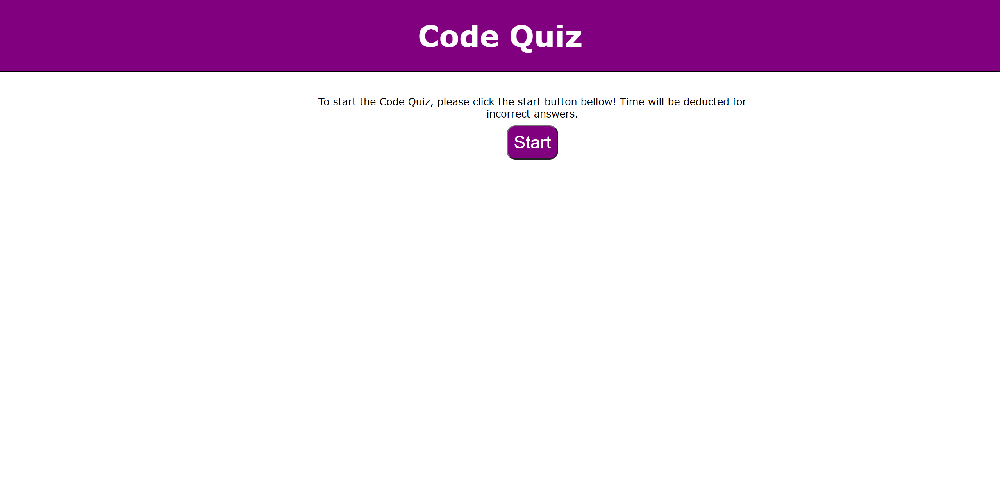
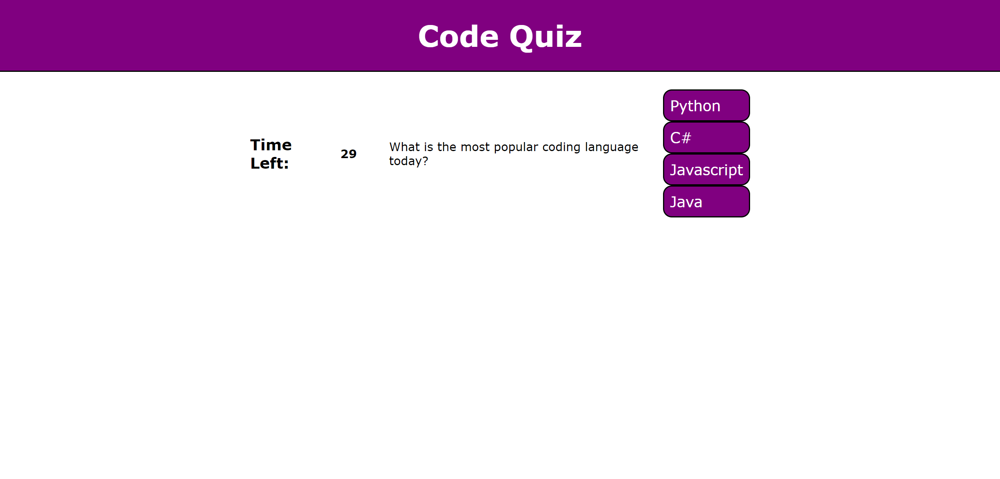
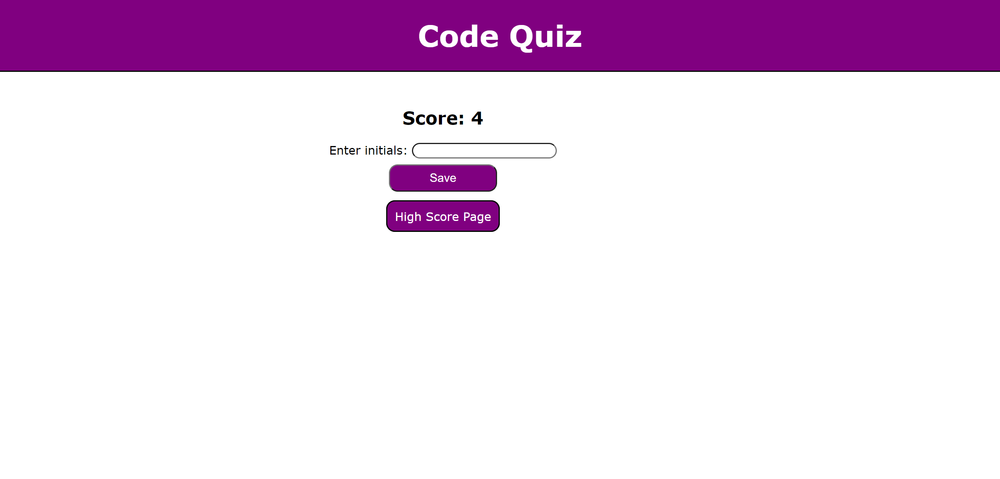
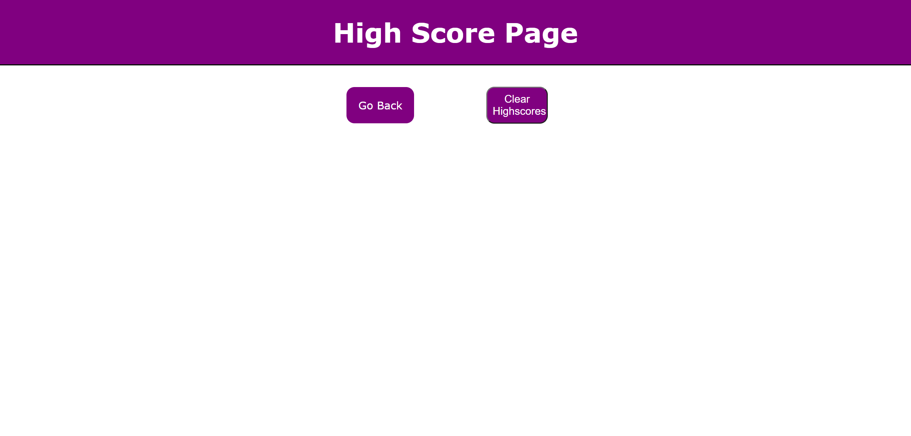

# Code-Quiz-SMM

This project is a homework assignment for Rutgers Coding Bootcamp.

## Click link to open in browser.
​
[github pages site] https://imaparadox.github.io/Code-Quiz-SMM/
​
## Description 
Click the start button to begin the quiz. Once the game starts a timer will countdown from 75 seconds and the first question will appear. Select an answer to continue to the next question. Bear in mind that wrong answers will subtract 10 seconds from the timer. When all questions are answered or the timer reaches 0, the game is over. The user can then click the "High Scores" button to enter their initials and save their score. 

## Full Browser

## Quiz Questions

## Score Results 

## High Scores

## Notes
I wasn't able to figure out the javascript logic for the high scores page. I plan on updating it at a future date.

## Licenses
N/A

## Acknowledgments for advice and assistance:
N/A